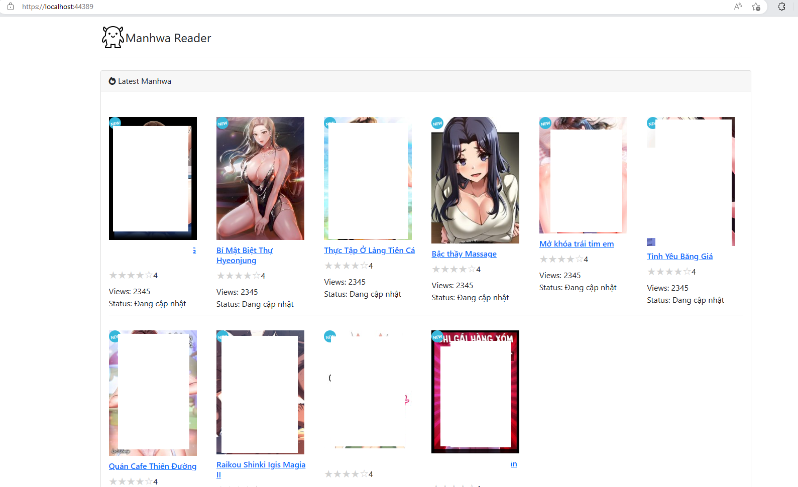

 

  

  <h3 align="center">ReadME</h3>

  

    SayHenTai Crawler
     
     
  

## About

Một dự án nhỏ crawler truyện về để đọc. Đỡ phải xem quảng cáo

## Getting Started

1. Mở project bằng Visual studio 2022 
2. Chọn Build để get nuget về
3. Run IIS để xem giao diện
4. Chọn mục "Leech truyện" --> Copy link từ sayhxxx.me về paste vào và thưởng thức

### Installation

1. Yêu cầu .NET 7 SDK
2. Visual studio 2022
3. MSSQL 

## License

Distributed under the MIT License.

## Authors

* **CuongVu* - *Comp Sci Student* - [Cuong Vu](https://github.com/cuongvu0203) - *Built ReadME Template*
